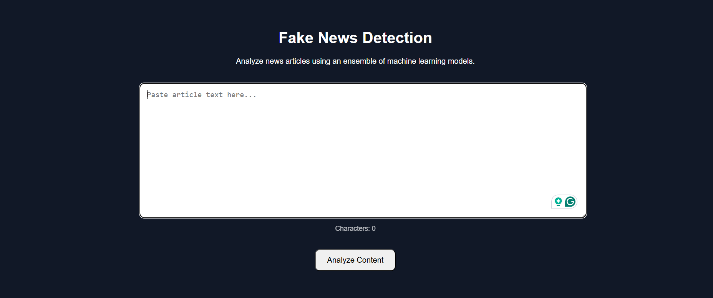
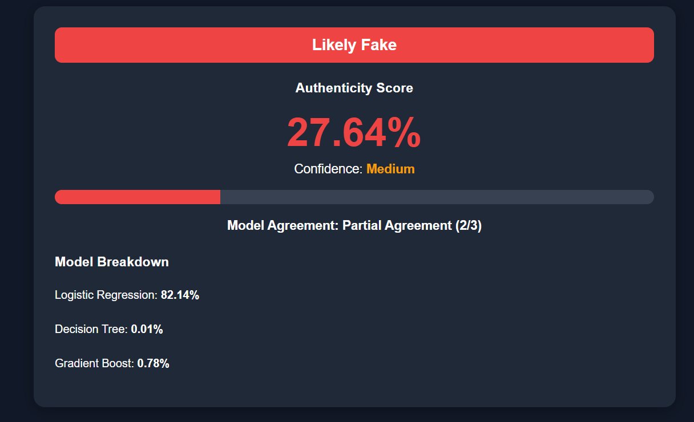

# Fake News Detection Web Application

A full-stack machine learning web application that analyzes news content and estimates the likelihood of it being real or fake using an ensemble of multiple classification models.

## Overview

This project combines machine learning and modern web development to create an interactive fake news detection platform.

Users can paste article content into the web interface and receive:

* An overall credibility score
* A final prediction verdict
* Individual predictions from multiple machine learning models

The application uses a Flask backend for model inference and a React frontend for the user interface.

---

## Features

* Clean React-based user interface
* Flask REST API backend
* TF-IDF text vectorization
* Ensemble prediction system
* Individual model confidence breakdown
* Real-time content analysis
* Local deployment for development and demonstration

---

## Tech Stack

### Frontend

* React
* Vite
* JavaScript
* Fetch API

### Backend

* Python
* Flask
* Flask-CORS
* Scikit-Learn
* Joblib

### Machine Learning

* TF-IDF Vectorization
* Logistic Regression
* Decision Tree Classifier
* Gradient Boosting Classifier

---

## Project Structure

```text
Fake News Detection App/
│
├── backend/
│   ├── app.py
│   └── model_service.py
│
├── frontend/
│   ├── src/
│   ├── public/
│   └── package.json
│
├── models/
│   ├── logistic.pkl
│   ├── decision_tree.pkl
│   ├── gradient_boost.pkl
│   └── vectorizer.pkl
│
├── training/
│   ├── Fake.csv
│   ├── True.csv
│   └── model_training.ipynb
│
├── .gitignore
└── README.md
```

---

## How It Works

1. User submits article text through the React frontend.
2. The frontend sends the content to the Flask API.
3. The backend preprocesses and vectorizes the text using TF-IDF.
4. Multiple machine learning models generate predictions.
5. The system calculates an overall ensemble score.
6. Results are returned and displayed in the user interface.

---

## Running Locally

### Backend

Navigate to the backend directory and install dependencies:

```bash
pip install flask flask-cors scikit-learn pandas numpy joblib
```

Start the Flask server:

```bash
python app.py
```

The backend will run on:

```text
http://127.0.0.1:5000
```

---

### Frontend

Navigate to the frontend directory:

```bash
npm install
npm run dev
```

The frontend will run on:

```text
http://localhost:5173
```

---

## Future Improvements

* Cloud deployment
* User authentication
* Article URL analysis
* News source credibility scoring
* Improved model training pipeline
* Modern dashboard visualizations
* Containerization using Docker

## Application Preview

### Home Screen



### Prediction Result



---

## Author

Developed by Aadish Tamaskar.

Created as a machine learning project and later redesigned into a full-stack web application using Flask and React.